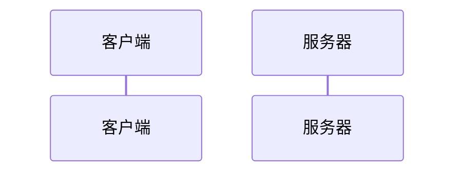

session的工作原理  

5.4 在express中使用session中间件
安装express-session中间件
配置

了解session认证的局限性

session认证机制需要配合cookie才能实现，由于cookie默认不支持跨域访问，所以当涉及到前端跨域请求后段接口时，需要做很多额外的配置，才能实现跨域session认证

注意：当请求后端接口不涉及跨域问题时，推荐使用session

S